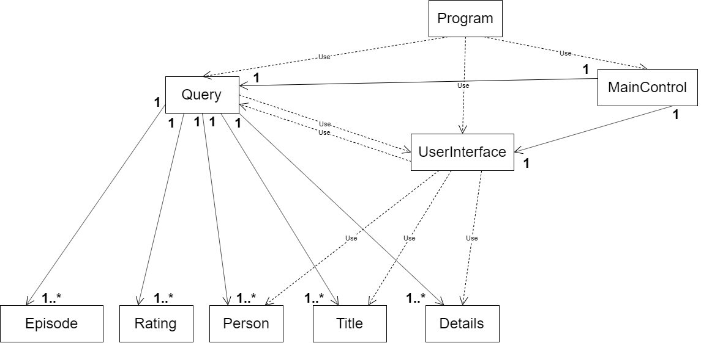

# Relatório do 1º Projeto de Linguagens de Programação II

## Base de Dados IMDB

**Projeto realizado por:**
- [Guilhereme Saturno, a21700118](https://github.com/guisaturno)
- [Lucas Viana, a21805095](https://github.com/LucasViana18)
- [Rita Saraiva, a21807278](https://github.com/RitaSaraiva)

## Indicação do trabalho realizado pelos membros do grupo:

- Guilherme Saturno:
  - Fase 3 e assistencia assistência na fase 1, 2, 4;
  - Realização da arquitetura e planeamento do código;
  - Realização de parte do relatório, em conjunto com Rita Saraiva e Lucas
  Viana.
  

- Lucas Viana:
  - Fase 2 e fase 4 do projeto, assistência na fase 1 e 3;
  - Organização do código, vários _fixes_ e comentários;
  - Realização de parte do relatório, em conjunto com Rita Saraiva e Guilherme
  Saturno.

- Rita Saraiva:
  - Fase 1 do projeto, inicio da fase 2 do projeto e assistência na fase 4;
  - Metade do _reFactor_, com Lucas Viana;
  - Doxygen;
  - Diagrama UML;
  - Realização do relatório, com Lucas Viana e Guilherme Saturno.

## Descrição da solução

### Arquitetura da solução:

O código inicialmente foi estruturado com menor complexidade, onde a parte da
interface estava colocada no Program e as _queries_ ficavam na sua própria
classe, sendo que no final o codigo foi alterado com o objetivo de uma melhor
organnização e funcionalidade. Foram utilizadas listas, com o objetivo de
guardar o conteudo dos ficheiros, no qual parte foi feita _parsing_ e outra
stingse para filtrar certos pedidos do utilizador(pesquisa de Titulo, Pessoa,
detalhes de ambos, pesquisa de episódios de uma série e a serie de um episódio
e a pesquisa do elenco de um certo titulo e vice-versa), utilizando
`IEnumerables`. Foram criados e utilizados métodos dentro da classe `Query` 
para poder limpar as listas desnecessárias no momento prevenindoassim o 
vazamento de memória.

### Diagrama UML:

### Referências:

1. Utilizada a [API do .NET](https://docs.microsoft.com/en-us/dotnet/api/) e 
[StackOverFlow](https://stackoverflow.com/);
2. Foram utilizadas bibliotecas como o `LINQ` par realizar as _queries_ e `IO` 
para importar ficheiros.
